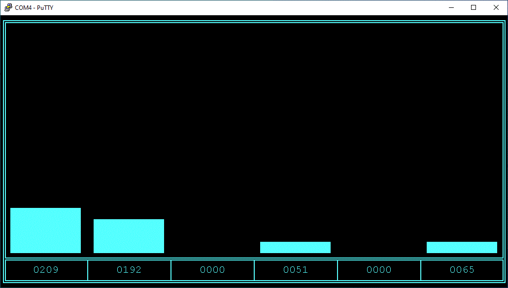

# Arduino Analogue Bar Charts
6-channel Analogue bar charts using terminal box-drawing characters

Works well with PuTTy terminal emulator in 80*24 screen resolution. 

Refreshes every second by setting cursor to home position and re-writing entire screen.
